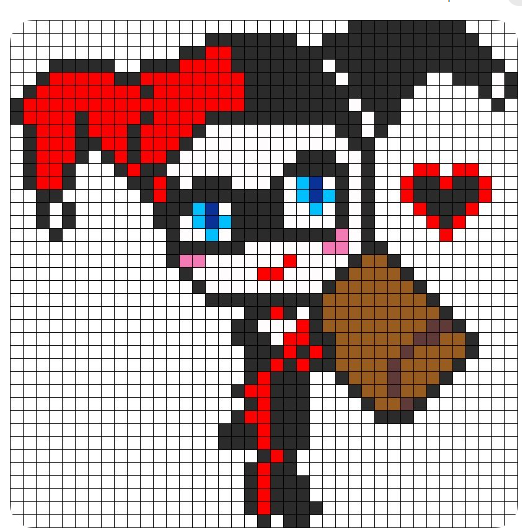
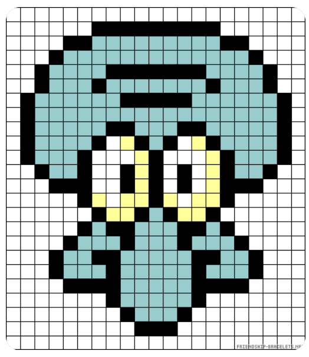

# Colors, functions, loops

This assignment is mostly practice. Your goal is to create at least 3 characters like:



2 of the pictures can be the same but differ in color. The last one must be unique. You can generate whatever picture you like as long as it is a minimum of 8x8. You probably should not go over 20x20 but it is up to you.


```python
canvas = tk.Canvas(root, width=600, height=400, bg='white')#line 7

canvas.create_rectangle((0, 20), (20, 40), fill=from_rgb((255,0,0)))#line 14
canvas.create_rectangle((0, 0), (20, 20), fill=from_rgb((0,255,0)))#line 15
canvas.create_rectangle((0, 20), (20, 40), fill=from_rgb((0,0,255)))#line 16
colors = [from_rgb((255,0,0)), from_rgb((125,17,45)), from_rgb((187,45,214)), from_rgb((2,25,91)), from_rgb((0,255,0)), from_rgb((0,0,255))]#line 18
```

Change your canvas size with line 7. Line 14-16 are examples of pixels and should be delete or commented out. All pixels should be the size of line 14 but the color will differ. Line 18 is a list of colors. You should use more than one list. To make more colors use `from_rgb((255,0,0)))`. This one makes red because the first is red, second is green and last is blue. You can use any number from 0-255 to get many ranges of colors. Go to https://www.w3schools.com/colors/colors_picker.asp for more help with colors. You must use colors[0] to select red, colors[4] to select green. If you change your color list then you must change accordingly.


# Task 1
## Implement  pixel(top_left_x, top_left_y, color)

Notice how `canvas.create_rectangle((0, 20), (30, 40), fill=from_rgb((255,0,0)))` creates a pixel. 
think of it as `canvas.create_rectangle((x_start, y-start), (x-end, y-end), fill=color`. So (0,20), (30,40) is 0 to 30 wide and 20 to 40 tall.

1.Create one square or pixel that is 20 by 20. Do not [hardcode](https://www.pcmag.com/encyclopedia/term/hard-coded) it in a specific location like the example above but pass in the arguments so that its position can by dynamic

This should be a helper function. That is it only gets called within another function. 

Hint: You will need to call your function somewhere around line 46 to test it. Just make sure you test it before `root.mainloop()` You will ultimatly comment it out since it is a helper function


#

# Task 2
## Implement color_row(row, column_start, column_end, color)
Implement a row of pixels that are the same color within the function `color_row`

1. create a for loop similar to:
```python
for x in range(2, 6):
  print(x)
```

Your going to need to determine what goes in the place of 2 and 6

2. inside the loop call `pixel()` to make the pixel

hint: since a pixel is 20 wide you don't want to make a pixel at 0,1,2,3,4,5...there just going to stack on top of eachother
##

# Task 3
## Implement character_1(colors)
Implement one of your images within the function `character_1`

1.implement your image using your two previous helper functions

Do not hardcode your colors in. Use the colors argument. This argument will be an array of colors. So to use a color you will do `fill=colors[0]`
##

# Task 4
## Implement character_2(colors)
Implement the second of your images within the function `character_2`
##

## Task 5
1. Call the function to create character_1, character_2 and character_3. You will not have a character_3 as you will just use a different list of colors on one of the previous 2 characters.
2. You will only be able to draw one character at a time so comment out the first two calls to draw your third character.
##

If you functions are hardcoding and not using the given arguments your assignment will not be accepted.
